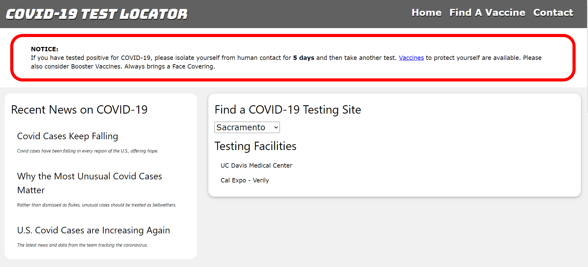
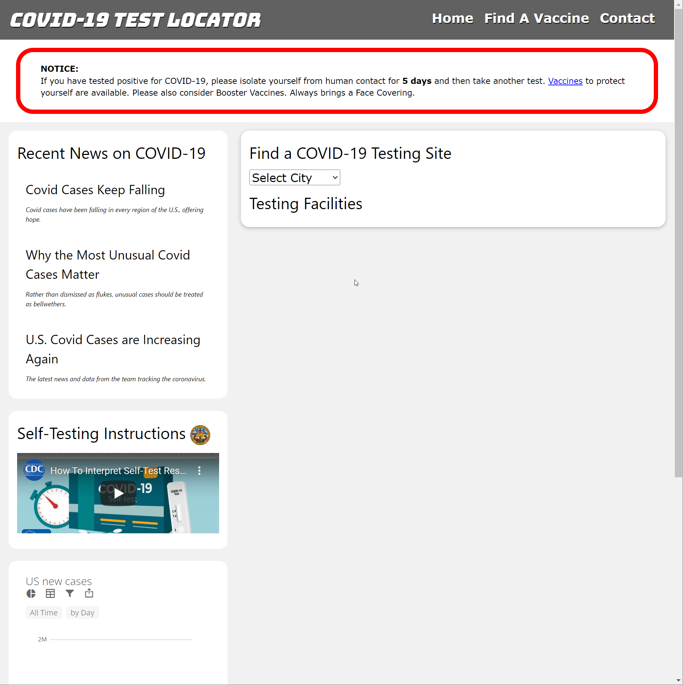

# Covid19-Testing-Site-Locator

## Description

A web application that allows users to search for COVID-19 testing facilities within a selected city from a dropdown list. As users select their test sites, additional information regarding specific address will display. Additional links regarding finding COVID vaccination sites, trending news articles from NY times, and graph data of recent cases will be displayed on the application as well.

## [Try it yourself!](https://maestroluu.github.io/Covid19-Testing-Site-Locator/)

The following images show a glimpse of the application:

## Desktop Functionality
Desktop Scrolling  
  
Desktop News Links  
  
Dekstop Testing  
  

## Mobile Functionality

## Getting Started

This is a simple application that runs right in the browser, no installation or downloads needed.

## Built With:

HTML  
JavaScript/jQuery  
W3 CSS  
NY TImes API  
Postman Covid Sites API

## Author:

David Luu  
Marco Flores  
Giovanni Barranco  
Maxwell Scheller

## Planned Updates

- As we attain more APIs regarding testing sites, we will increase the pulled data to provide a larger array for users to search.
- We plan to implement geocoding in future developments so that gps coordinates can be referenced when searching for testing sites nearby.